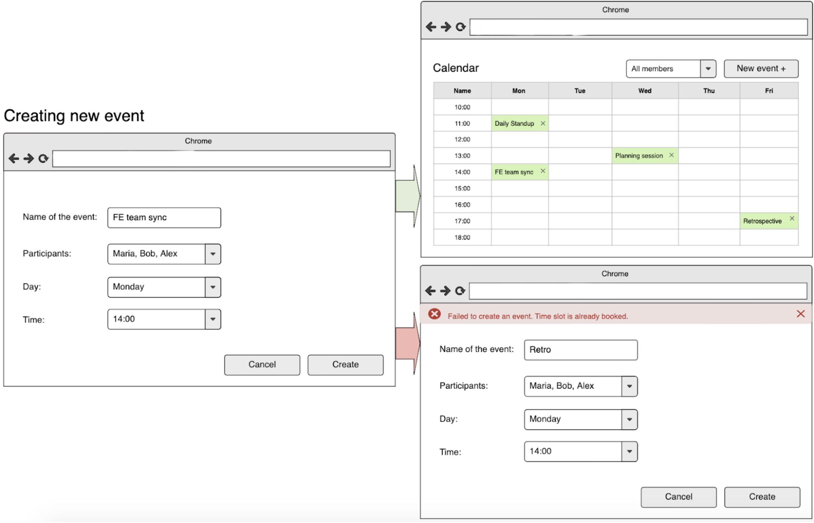

<h1> General info </h1>

Create a simple meeting planning calendar for a meeting room in your office:
<ul>
<li>display meetings planned</li>
<li>filter meetings for a particular team member</li>
<li>add new meetings</li>
<li>delete meetings</li>
</ul>

## <h1>Technology Stack </h1>

 
 
&nbsp
&nbsp

## <h1>Wireframes</h1>

